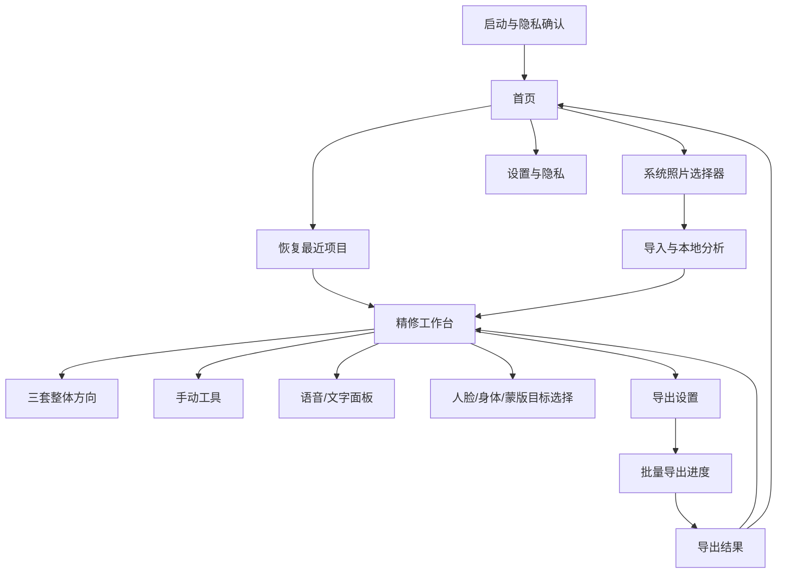

# 映见 MVP 交互设计 PRD

> 状态：interaction-draft / implementation-baseline
> 版本：1.1
> 日期：2026-08-28
> 首发平台：iOS / TestFlight
> 产品 Slogan：让变美更容易
> 核心承诺：一张精修，整组好看

本文档定义映见 MVP 的信息架构、页面层级、用户旅程、交互行为、状态反馈、文案和可用性验收，是交互原型、Flutter UI 与集成测试的共同实施基线。

本文档不重新定义算法范围、图像质量阈值、工程架构或发布状态：

- P0 功能范围与总体验收以 [MVP Spec](mvp-spec.md) 为准。
- 稳定产品策略以[产品上下文](product-context.md)为准。
- 领域名词以 [`CONTEXT.md`](../../CONTEXT.md) 为准。
- 图像质量、性能、真机与盲评以[质量基线](../quality/mvp-quality-baseline.md)为准。
- 本文档与 MVP Spec 冲突时，先停止实施并同步修正文档，不在代码中自行选择一种解释。

## 1. 执行摘要

映见不是把专业修图软件的全部工具压缩到手机上，而是帮助用户完成一条清晰、最短的任务链：

> 提供图片 → 说明修改方向 → 看见修改结果。

这是所有界面的最高裁决原则：默认减少操作与专业概念，图片和结果占据主要空间，当前步骤、处理状态、结果、撤销与保存保持高可见。只有当前任务需要时，才渐进展开人物、范围和专业参数。

MVP 交互围绕一个连续闭环组织：

```text
开始修图
  → 导入 1–6 张照片
  → 本地分析
  → 选择一个整体方向
  → 用语音、文字或手动参数继续修改
  → 在当前照片与整组之间明确切换
  → 逐张检查
  → 批量导出
```

核心设计决策：

1. 首页使用重新设计版 Stitch 的轻量四项底栏，但仍只突出“选择照片”“拍一张”和最近草稿；底栏入口必须复用现有任务流，不创建空白频道。
2. 编辑器以照片和修改结果为视觉中心，不建立第二套页面导航。
3. “还想怎么改？”是主入口；语音、文字、高频建议和手动参数汇入同一编辑配方。
4. 用户先看到结果，再按需展开参数；不会先面对几十个工具。
5. AI 每次修改都必须产生立即可见的结果，并允许撤销和继续调整。
6. 只有操作可能影响多张照片或特定人物时，才明确展示范围和目标；不让用户预先管理内部对象。
7. 处理中、已应用、失败与可恢复状态必须清晰可见，不以长期遮挡照片的弹窗反馈。
8. 默认闭环在本地完成；拒绝语音权限不影响文字和手动修图。

## 2. 产品目标与非目标

### 2.1 MVP 目标

- 让不熟悉专业参数的用户在导入后 30 秒内得到一个可接受的第一结果。
- 让用户无需重复修 2–6 张照片，也能得到风格一致但不过度机械的整组结果。
- 让用户能够用“亮一点”“皮肤自然一点”等表达继续修改，同时保持结果可控。
- 提供足够完整的基础修图、人像、塑形和局部能力，使用户不必因为基础能力缺失立即转向其他 App。
- 在不上传照片的默认路径中完成导入、编辑、恢复和导出。

### 2.2 MVP 非目标

- 不复制竞品的模板、社区、拍摄、美妆、贴纸和视频功能矩阵。
- 不让首页承担工具分类或内容推荐任务。
- 不使用聊天记录作为独立编辑历史。
- 不让 AI 绕过参数合同直接生成不可解释的基础修图结果。
- 不把功能入口存在等同于图像质量达标。
- 不在本轮引入账号、订阅、权益或生成式图片任务。

## 3. 目标用户与核心任务

### 3.1 第一目标用户

第一目标用户符合 `first-target-user-v1`：

- 经常使用手机拍照；
- 会一次发布多张照片；
- 希望照片自然、干净、有氛围；
- 不愿学习复杂专业流程；
- 愿意从可靠结果开始，只做少量微调。

主要场景是旅行、聚会、探店和日常记录结束后，整理 2–6 张准备发布的照片。

### 3.2 三个最高优先级任务

| 优先级 | 用户任务 | 用户心智中的成功 |
| --- | --- | --- |
| JTBD-1 | 快速把照片修得更好看 | 不懂参数也能先得到自然结果 |
| JTBD-2 | 把一组照片修得统一 | 不需要每张重复操作，单张又不会失真 |
| JTBD-3 | 按自己的话继续修改 | 可以直接说、输入或拖动，并知道改了什么 |

### 3.3 用户心理模型

用户面对的不是“工程管线”，而是四个简单概念：

1. **照片项目**：这次要处理的一组照片。
2. **整体方向**：自然、氛围或质感三种起点。
3. **修改范围**：整组或当前照片。
4. **修改方式**：说出来、写出来或直接调工具。

共享风格、逐张补偿和单张覆盖属于内部配方层级；界面只在必要时用用户语言解释结果，不暴露内部对象名。

## 4. 信息架构

### 4.1 IA thesis

映见采用**任务优先、生命周期推进**的组织方式。用户始终沿“选择照片 → 选择方向 → 继续精修 → 检查整组 → 导出”的任务前进；复杂参数只在编辑上下文中渐进展开，不成为全局导航。

### 4.2 App map



### 4.3 全局导航

MVP 首页按重新设计版 Stitch 使用四项图标底栏，编辑器仍不保留全局底栏，避免占用照片预览空间。四项不是四个独立内容频道，而是同一修图任务的快捷入口：

- 首页：回到当前首页状态；
- 照片：开始新的相册导入流程；
- 编辑：恢复最近项目，没有项目时进入导入；
- 我的：进入设置、隐私与关于。

其他全局入口包括：

- 首页主按钮“开始修图”；
- 首页最近项目；
- 首页右上角“设置”；
- 编辑器返回首页；
- 导出完成后“返回首页”。

### 4.4 编辑器上下文导航

编辑器默认只呈现三层用户任务，不把工具分类当作常驻导航：

1. **照片层**：当前照片、照片计数、上一张/下一张、添加/移除。
2. **意图层**：一句“还想怎么改？”、常用自然语言建议和“自己调”。
3. **结果层**：查看原图、全屏看效果、撤销和保存。

构图、光色、滤镜、画质和人像等参数只在用户主动进入“自己调”后出现；任意时刻只允许一个工具区处于展开状态。

## 5. 核心对象与状态模型

### 5.1 核心对象

| 对象 | 用户可见身份 | 主要操作 |
| --- | --- | --- |
| 照片项目 | 最近项目卡片、项目内 1–6 张照片 | 创建、恢复、删除、继续添加 |
| 项目照片 | 预览、缩略图、序号 | 选择、排序、移除、设为当前 |
| 推荐方案 | 自然干净、氛围色彩、质感风格 | 预览、选择、减弱、替换 |
| 编辑配方 | 各工具的可见参数结果 | 应用、撤销、重做、归零、恢复 |
| 编辑范围 | 整组、当前照片 | 切换、确认影响范围 |
| 编辑目标 | 当前人脸、身体主体、主体/局部蒙版 | 选择、切换、清除 |
| 导出任务 | 当前照片或整组的导出批次 | 开始、取消、重试失败项 |

### 5.2 配方层级与界面语义

最终有效效果按以下层级合成：

```text
共享风格
  + 每张照片的安全补偿
  + 当前照片的单张修改
  + 当前人脸/身体/蒙版的目标修改
```

交互规则：

- “整组”修改写入共享风格，并为每张照片保留安全补偿。
- “当前照片”修改只写入当前照片的单张覆盖。
- 人脸、身体和蒙版参数永远绑定当前照片中的明确目标。
- 切换范围不会复制或删除已有层级。
- 重置当前工具只清除当前范围、当前目标下对应参数。
- “恢复原始”必须先说明将清除的范围，并支持立即撤销。

### 5.3 项目生命周期

```text
empty
  → importing
  → analyzing
  → recommendation_ready
  → editing
  → exporting
  → partially_exported / exported / export_cancelled
  → editing / archived / deleted
```

应用被系统终止或进入后台时，项目必须停留在最近一个可恢复状态。临时预览失败不能损坏已保存配方。

## 6. 视觉与交互总原则

### 6.1 结果优先

- 进入编辑器先显示照片和三套方向，不先显示工具参数。
- 选择方向后才展开完整工具区。
- 参数面板最多显示一层同级选择和一个当前参数控制。
- 缩略预览用于推荐、滤镜和背景；普通滑杆不重复生成缩略图。

### 6.2 照片中心

- 竖屏下照片预览占主要视觉区域。
- “自己调”采用页面内底部工具坞，不使用遮挡照片的模态弹窗；工具展开后照片仍需持续可见。
- 点击照片或全屏图标进入沉浸预览：照片铺满可用区域，只保留返回、序号、“调整后”和底部操作提示。
- 沉浸预览中长按显示原图、松开恢复调整后效果，轻点返回原工具位置和参数上下文。
- 语音面板使用可收起的底部抽屉，不成为独立聊天页。
- 导出与主要操作固定在拇指可达区域，不随工具列表滚走。

### 6.3 一屏一个主要决定

- 首页：开始修图。
- 推荐阶段：使用这套效果。
- 工具阶段：调整当前参数。
- 语音阶段：应用修改。
- 导出阶段：开始导出。
- 结果阶段：查看结果或重试失败项。

### 6.4 持续可见的上下文

编辑器必须持续让用户知道：

- 当前是哪一张照片；
- 项目共多少张；
- 当前修改作用于整组还是当前照片；
- 当前选中的人脸、身体或蒙版目标；
- 当前是否有未归零参数；
- 是否可以撤销、重做和导出。

## 7. 页面与界面规格

### 7.1 P0-01 启动与隐私确认

#### 目的

在首次启动时用最少信息建立本地处理、隐私和可选诊断的信任边界。

#### 内容层级

1. 品牌与 Slogan。
2. 一句话价值：“选择照片，先看三套效果，再按你的方式细调。”
3. 本地处理说明：“默认不会上传照片。”
4. 主按钮“开始使用”。
5. 隐私政策与用户条款入口。
6. 匿名诊断默认关闭；如需开启，作为独立显式选择。

#### 交互规则

- 不要求登录、手机号或昵称。
- 不在此页请求照片、麦克风或语音权限。
- 用户确认后直接进入首页。
- 隐私或条款加载失败时允许读取本地打包版本。

### 7.2 P0-02 首页

#### 目的

让新用户立即开始，让返回用户继续未完成项目。

#### 布局

- 顶部：映见品牌、设置入口。
- 主区域：大按钮“开始修图”。
- 次区域：“最近项目”，按最近编辑时间排列。
- 空态：展示“一张精修，整组好看”和开始按钮，不展示教程轮播。

#### 最近项目卡片

每张卡片展示：

- 最多三张项目缩略图；
- 照片数量；
- 最近编辑时间；
- 最近状态：编辑中、导出部分失败或已导出；
- 点击进入项目；
- 长按或更多菜单中提供“删除项目”。

#### 交互规则

- “开始修图”打开系统照片选择器。
- 最近项目按最近编辑时间纵向排列；首屏最多露出 3 个，继续向下滚动可查看全部本地项目，不增加独立项目导航页。
- 删除项目前说明会删除应用内副本、配方和缓存，不影响系统相册原图。
- 首页不展示工具、模板、内容流或促销位。

### 7.3 P0-03 照片选择与导入

#### 目的

完成 1–6 张照片选择，并明确本地副本与系统原图的关系。

#### 交互规则

- 使用系统照片选择器。
- 顶部或选择器说明“最多选择 6 张”。
- 选择超过 6 张时阻止继续，并说明上限。
- 支持的静态图片进入导入队列；不支持项逐项显示原因。
- 至少一张成功时允许继续；全部失败时返回首页并提供重新选择。
- 导入后立即创建应用自有只读副本，不覆盖系统原图。

#### 加载状态

使用连续状态而不是多个跳页：

```text
正在导入 2/6
  → 正在分析光线与人物
  → 已准备三套效果
```

- 显示总进度和当前阶段。
- 提供取消；取消后删除尚未纳入项目的临时文件。
- 单张分析失败使用安全回退，不阻断整个项目。

### 7.4 P0-04 推荐阶段

#### 目的

让用户先选整体方向，而不是先理解参数。

#### 页面结构

- 顶部：返回、标题“精修工作台”、删除项目。
- 照片预览：默认当前第一张，可按缩略图切换。
- 项目信息：当前照片名称/序号、添加、移除。
- 范围提示：“第 1/6 张 · 选择方向将用于整组”。
- 三张推荐卡片：自然干净、氛围色彩、质感风格。
- 固定主按钮：“使用这套效果”。
- 底部次操作：撤销、重做、重置；无历史时禁用。

#### 推荐卡片

每张卡片必须包含：

- 当前照片效果缩略图；
- 稳定名称；
- 一句结果描述；
- 主推荐或备选标识；
- 选中状态不只依赖颜色。

默认选中主推荐，但必须由用户点击“使用这套效果”后才进入正式编辑状态。

#### 推荐行为

- 切换推荐只预览，不反复创建持久化历史。
- 确认推荐作为一次可撤销操作写入整组共享风格和逐张补偿。
- 切换照片时，三套推荐保持同一方向身份，但缩略预览使用对应照片结果。
- 推荐分析失败时仍提供三套冻结安全回退，并显示“使用安全基础效果”，不暴露工程错误。

### 7.5 P0-05 精修工作台

#### 目的

承载全部核心编辑能力，同时保持照片、范围和操作历史可理解。

#### 默认竖屏布局

```text
┌ 顶部栏：返回 / 映见 / 保存 / 更多 ┐
│                                          │
│             照片预览区                   │
│      查看原图 / 点击进入全屏预览           │
│                                          │
├ 照片栏：序号 / 上一张 / 下一张 / 添加 / 移除 ┤
├ 已应用效果 / 撤销                         ┤
├ 自然语言建议                              ┤
└ 还想怎么改？ / 语音 / 自己调               ┘
```

范围、工具分类和参数均不是默认首页信息。只有在用户进入“自己调”后，底部工具坞才显示当前范围、同步动作、工具类别、一个当前参数和一个滑杆；点击“完成”折叠工具坞，照片区域不离开页面。

#### 顶部与照片预览

- 点击“查看原图”或在沉浸预览中长按，暂时显示原图，松开恢复效果。
- 点击照片或全屏图标进入沉浸预览；轻点照片或点击返回退出，退出后保留“自己调”的分类、参数和滚动上下文。
- 前后对比不能改变配方或历史。
- 预览加载时保留上一帧并显示轻量进度，不闪回空白。
- 预览失败时显示重试，同时保留工具状态和导出能力。

#### 照片栏

- 始终显示 `当前序号/总数`。
- 1 张照片时上一张/下一张禁用，不隐藏位置。
- 切换照片保留当前工具类别，但如果工具不适用则显示对应空态。
- 添加照片最多补至 6 张；新照片完成分析后继承共享风格并生成自己的逐张补偿。
- 移除当前照片前确认；项目只剩一张时仍可移除，但说明会删除整个项目或返回首页。

#### 范围栏

范围控件采用带文字的双选分段控件：

- `整组`：修改共享方向，并按每张照片安全适配。
- `当前照片`：只修改当前照片。

规则：

- 默认编辑态不暴露范围控件；“自己调”展开时以紧凑菜单明确显示当前范围。
- 首次进入正式编辑默认“当前照片”，防止无意覆盖整组。
- 用户第一次切到“整组”时显示一次性说明：“会保持同一风格，每张照片仍会单独适配。”
- 人脸、身体、局部蒙版等目标工具强制使用“当前照片”；进入时范围控件显示锁定状态和原因。
- 语音或文字提到“全部、整组、这几张”时可以建议切换范围，但在不确定时必须让用户确认。

#### 一级工具

“自己调”内保留六类完整基础能力：

1. 构图
2. 光色
3. 滤镜与 HSL
4. 画质
5. 人像
6. 主体与局部

工具横向滚动时，当前选中项保持可见；默认编辑态不展示这六类，避免让首次用户先理解专业结构。

#### 参数控制通则

- 每次只突出一个当前参数及其滑杆。
- 滑杆旁持续显示数值与单项归零按钮。
- 中性值为 `0`；双向参数使用 `-100...100` 的用户显示尺度。
- 只增强参数使用 `0...100`。
- 拖动时实时预览；松手后合并为一次撤销历史。
- 点击另一个参数前保存当前值，不要求额外“完成”。
- 参数变化后，分类和参数项显示轻量已修改标记。
- 长按参数名可以查看一句说明，不使用专业算法术语。

#### 底部操作栏

- 撤销：回退最近一次用户动作或一次 AI 配方应用。
- 重做：恢复最近一次撤销。
- 重置：清除当前工具、当前范围、当前目标下的修改；二次确认仅用于影响多个参数的重置。
- 语音：48pt 以上麦克风入口，辅助名称“说说怎么修”。
- 导出：主按钮，显示“导出 1 张”或“导出 6 张”。

操作栏固定在安全区域内，不随工具面板滚动，不被键盘、浮动按钮或长文案遮挡。

### 7.6 P0-06 语音与文字修图面板

#### 目的

让用户用自然表达修改照片，同时保留确认和手动控制。

#### 面板结构

1. 标题“描述你想要的效果”。
2. 隐私说明：“语音只用于转写指令；修图结果仍由可见参数在本地生成。”
3. 2–4 行可编辑文字框。
4. 次按钮“开始说话”/“停止”。
5. 主按钮“应用修改”。
6. 需要时显示理解结果、目标或范围确认。

#### 语音状态

| 状态 | 展示 | 可用操作 |
| --- | --- | --- |
| idle | 输入提示与“开始说话” | 输入、录音、应用 |
| requesting_permission | 系统权限请求前说明用途 | 继续或取消 |
| listening | 动态指示、“正在听…”、“停止” | 停止、关闭 |
| transcribed | 可编辑转写文字 | 修改、应用、重新录音 |
| interpreting | “正在整理修改…” | 取消面板，不修改配方 |
| needs_scope | 显示“整组/当前照片”选择 | 选择后应用 |
| needs_target | 在照片中选择人物/主体 | 选择后返回并应用 |
| unsupported | 说明无法安全理解 | 改写、使用手动工具 |
| failed | 说明语音暂不可用 | 继续输入文字 |

#### 应用规则

- 录音结束后先显示文字，不自动应用。
- 用户可以修改文字后再应用。
- 应用前解释器输出参数、范围和目标，不直接处理像素。
- 成功后关闭面板，显示“已应用 N 项可见参数”。
- 对应手动参数立即同步，并将参数分类标为已修改。
- 一次口令形成一个撤销历史；撤销恢复所有由该口令造成的参数变化。
- 部分可理解、部分不可理解时不得静默忽略；应列出可执行部分并让用户确认。
- 无法确定人物、身体或范围时不猜测执行。

#### MVP 首批表达

- “照片亮一点/暗一点”
- “暖一点/冷一点”
- “皮肤自然一点/自然美化”
- “不要磨皮/关闭磨皮”
- 以上指令的简单组合

后续扩展必须沿用相同参数语义，不能改变旧指令的效果含义。

### 7.7 P0-07 构图工具

#### 二级工具

- 裁剪比例：自由、原始、1:1、4:3、3:4、16:9、9:16。
- 旋转：每次 90°。
- 翻转：水平、垂直。
- 校正：`-45°...45°`。
- 水平透视：`-30...30`。
- 垂直透视：`-30...30`。
- 恢复原始构图。

#### 交互规则

- 构图编辑进入专注模式，预览显示裁剪框和网格。
- 主操作为“完成”，次操作为“取消”；取消不产生历史。
- 构图默认只作用于当前照片。
- 用户主动选择整组构图时，系统必须逐张预览适配结果，不能把绝对裁剪坐标机械复制到不同尺寸照片。
- 透视和校正始终显示剩余有效画面，避免导出黑边。

### 7.8 P0-08 光色工具

#### 参数

| 参数 | 用户尺度 | 中性值 | 默认范围 |
| --- | --- | --- | --- |
| 曝光 | -100...100 | 0 | 整组或当前照片 |
| 高光 | -100...100 | 0 | 整组或当前照片 |
| 阴影 | -100...100 | 0 | 整组或当前照片 |
| 对比度 | -100...100 | 0 | 整组或当前照片 |
| 色温 | -100...100 | 0 | 整组或当前照片 |
| 色调 | -100...100 | 0 | 整组或当前照片 |
| 饱和度 | -100...100 | 0 | 整组或当前照片 |
| 清晰度 | -100...100 | 0 | 整组或当前照片 |

内部可以使用归一化或 EV，但用户层统一显示清晰的整数尺度。范围切换不改变已有数值所属层级。

### 7.9 P0-09 滤镜与 HSL

#### 滤镜

- 首屏显示“原图”与至少 12 套冻结滤镜缩略图。
- 选择滤镜后显示强度 `0...100`。
- 强度为 0 时严格无效果，但保留当前选择以便用户恢复强度。
- 滤镜可作用于整组或当前照片；默认整组。
- 收藏、下载和在线滤镜不属于 MVP。

#### HSL

- 通道：红、橙、黄、绿、青、蓝、紫、洋红。
- 每个通道包含色相、饱和度、明度，均为 `-100...100`。
- 当前通道使用颜色和文字共同标识。
- HSL 默认整组；当某张照片需要补偿时用户可以切换当前照片。

### 7.10 P0-10 画质

#### 入口与参数

- 首项“一键改善画质”。
- 去噪 `0...100`。
- 暗光提亮 `0...100`。
- 去灰 `0...100`。
- 细节锐化 `0...100`。

#### 交互规则

- 一键改善只写入四个可见参数，不增加隐藏效果。
- 一键应用作为一个历史动作，但四个参数可以继续独立调整。
- 默认只作用于当前照片，避免不同噪声与暗光条件下机械同步。
- 当前输入不适用时，入口仍可见但说明原因，参数保持 0。
- 100% 查看细节作为辅助预览，不创建新页面层级。

### 7.11 P0-11 人像

#### 分组

人像工具采用三段局部导航：

1. 自然美化
2. 面部塑形
3. 身体塑形

#### 自然美化

- 一键自然美化。
- 质感磨皮 `0...100`。
- 肤色与面部光线 `0...100`。
- 瑕疵减弱 `0...100`。

一键自然美化只写入三个参数，不自动开启瘦脸、瘦身或五官变化。

#### 面部塑形

- 当前目标：画面人脸框或“人物 1/2/3”。
- 瘦脸 `0...100`。
- 小头 `0...100`。
- 下颌 `-100...100`。
- 下巴 `-100...100`。
- 大眼 `-100...100`。
- 鼻形 `-100...100`。
- 嘴形 `-100...100`。

#### 身体塑形

- 当前目标：画面身体轮廓或“人物 1/2/3”。
- 整体瘦身 `0...100`。
- 增高 `0...100`。
- 肩 `-100...100`。
- 腰 `-100...100`。
- 腿部 `0...100`。

#### 目标选择规则

- 单一高置信度目标自动选中，并显示目标轮廓。
- 多个目标必须在画面中点选；下方面板同步显示当前人物编号。
- 不确定目标时显示编号选择，不按年龄、性别或身份命名。
- 切换目标保留每个目标的独立参数。
- 当前目标不可用时只关闭对应能力，不阻断基础修图与导出。
- 人像和身体塑形始终限定当前照片，范围控件显示锁定。

### 7.12 P0-12 主体与局部

#### 子工具

- 主体蒙版：自动起始蒙版、添加、擦除、恢复。
- 背景：原始、虚化、纯色、用户图片。
- 主体光色：曝光、饱和度。
- 背景光色：曝光、饱和度。
- 局部光色：添加/擦除蒙版、曝光、饱和度。
- 传统消除：画笔、撤销笔画、清空。

#### 参数范围

- 背景虚化 `0...100`。
- 主体/背景/局部曝光 `-100...100`。
- 主体/背景/局部饱和度 `-100...100`。

#### 蒙版交互

- 进入蒙版工具后，预览显示半透明蒙版颜色；颜色不是唯一状态表达。
- 顶部显示“查看效果/查看蒙版”切换。
- 添加和擦除画笔都有尺寸控制。
- 空蒙版严格无效果。
- 关闭工具时保存蒙版；取消本次未确认笔画时恢复进入前状态。
- 用户图片背景先复制到应用私有目录，再进入配方。
- 所有主体与局部工具限定当前照片。

### 7.13 P0-13 导出设置

#### 入口

点击底部“导出 N 张”打开底部面板，不离开编辑器上下文。

#### 内容

- 导出范围：当前照片、全部照片。
- 尺寸：原像素尺寸；MVP 不提供任意缩放。
- 格式：保持受支持的默认高质量格式；如格式不可保持，明确说明输出格式。
- 元数据：默认遵守隐私合同，不在此页暴露复杂 EXIF 开关。
- 预计数量与可用空间提醒。
- 主按钮“开始导出”。

#### 规则

- 未选择推荐也允许导出，但提示“将按当前效果导出”。
- 导出前自动保存项目。
- 导出期间可返回编辑器查看，但不得修改正在导出的快照；新的修改属于下一次导出。
- 照片权限不足时在开始前说明并提供系统设置入口。

### 7.14 P0-14 导出进度与结果

#### 进度

- 展示总进度 `2/6`、当前照片缩略图和每项状态。
- 状态：等待中、处理中、已保存、失败、已取消。
- 提供“取消剩余任务”；已保存结果保留。
- 应用进入后台后保存任务状态；系统中止时下次启动说明实际结果。

#### 结果

| 终态 | 主文案 | 主要操作 |
| --- | --- | --- |
| 全部成功 | 已保存 6 张照片 | 查看相册、返回首页 |
| 部分失败 | 已保存 4 张，2 张失败 | 重试失败项、查看已保存 |
| 全部失败 | 暂未保存照片 | 查看原因、重试 |
| 已取消 | 已保存 2 张，剩余已取消 | 继续导出、返回编辑 |

- 分享操作只使用已成功保存或已生成的结果。
- 失败项保留配方和原图引用，可以独立重试。
- 结果页返回编辑器时保留当前照片、工具位置和历史。

### 7.15 P0-15 设置与信任

设置页只保留 MVP 必需项目：

- 匿名诊断：默认关闭。
- 隐私政策。
- 用户条款。
- 照片与语音权限状态及系统设置入口。
- 清除本地项目与缓存。
- App 版本信息。

设置不是底部一级导航；从首页右上角进入。危险操作单独分组并二次确认。

## 8. 完整关键流程

### 8.1 首次单张修图

```text
首次启动
→ 确认隐私
→ 首页点击开始修图
→ 系统选择 1 张照片
→ 本地导入与分析
→ 浏览三套推荐
→ 选择自然干净并确认
→ 当前照片范围下微调
→ 前后对比
→ 导出当前照片
→ 查看成功结果
```

成功标准：无需登录、无需语音权限、无需阅读教程即可完成。

### 8.2 整组快速修图

```text
首页开始修图
→ 选择 2–6 张
→ 选择整体方向
→ 切换整组
→ 调整共享光色或滤镜
→ 逐张检查补偿结果
→ 对重点照片切换当前照片并精修
→ 返回整组检查
→ 批量导出
```

成功标准：用户能正确说明整组修改和当前照片修改的影响范围。

### 8.3 语音/文字修改

```text
编辑器点击麦克风
→ 说“照片亮一点，皮肤自然一点”
→ 查看并修改转写
→ 必要时选择当前照片/整组或人物
→ 应用修改
→ 手动参数同步变化
→ 继续拖动参数或撤销整次口令
```

成功标准：用户知道 AI 修改了哪些可见参数，并能继续手动调整。

### 8.4 多人面部精修

```text
打开人像 → 面部塑形
→ 画面显示最多 3 个可用目标
→ 点选人物 2
→ 调整瘦脸/下颌
→ 点选人物 1
→ 确认其参数未被修改
→ 前后对比
```

成功标准：非目标人物、背景和目标身份保持稳定；目标选择始终可见。

### 8.5 权限拒绝与安全回退

```text
用户拒绝麦克风或语音权限
→ 面板显示语音不可用
→ 文字输入保持可用
→ 手动工具保持可用
→ 照片不上传
```

照片保存权限拒绝时，编辑和项目保存仍可继续，导出入口说明如何恢复权限。

### 8.6 项目恢复

```text
编辑中退出或系统终止
→ 返回首页
→ 最近项目显示编辑中
→ 点击恢复
→ 回到原照片、范围、目标、工具和配方状态
→ 撤销/重做语义保持正确
```

## 9. 状态与错误矩阵

| 场景 | 用户看到什么 | 系统行为 | 下一步 |
| --- | --- | --- | --- |
| 无项目 | 首页价值说明 | 不创建空项目 | 开始修图 |
| 导入部分失败 | 成功与失败数量 | 保留成功项 | 继续或重新选择 |
| 分析失败 | 安全回退说明 | 使用冻结配方 | 选择方向 |
| 无人脸 | 人像工具不适用 | 参数保持 0 | 使用其他工具 |
| 多人但目标不确定 | 编号目标框 | 不默认修改 | 选择人物 |
| 身体关键点不足 | 身体塑形不可用原因 | 不执行 warp | 使用其他工具 |
| 蒙版为空 | “请涂抹作用区域” | 严格无效果 | 添加蒙版 |
| 语音权限拒绝 | 语音不可用 | 不重复弹系统权限 | 输入文字 |
| 指令无法理解 | 无法安全理解 | 配方不变 | 改写或手动调整 |
| 范围不明确 | 整组/当前照片选择 | 暂不执行 | 选择范围 |
| 预览失败 | 保留上一帧与重试 | 不清空配方 | 重试或导出 |
| 空间不足 | 所需空间提示 | 不开始导出 | 清理后重试 |
| 导出部分失败 | 成功与失败明细 | 保留成功项 | 重试失败项 |
| 项目版本不兼容 | 无法安全恢复说明 | 不猜测迁移 | 保留原图并新建项目 |

错误文案必须包含：发生了什么、当前结果是否安全、用户下一步可以做什么。不得只显示错误码。

## 10. 标签与文案规范

### 10.1 固定标签

| 概念 | 固定用户标签 | 不使用 |
| --- | --- | --- |
| 新建任务 | 开始修图 | 新建工程、创建会话 |
| 多图范围 | 整组 | 批量模式、全局层 |
| 单图范围 | 当前照片 | 局部模式、单张覆盖 |
| 三套起点 | 整体方向 | AI 模板、生成方案 |
| 参数集合 | 修改/效果 | Pipeline、Recipe |
| 比较 | 查看原图 | Baseline、Bypass |
| 清零当前参数 | 归零 | 清除数据 |
| 清除当前工具 | 重置 | 恢复出厂 |
| 语音入口 | 说说怎么修 | AI 助手、智能体 |

### 10.2 文案语气

- 使用短句和用户语言，不解释算法。
- 结果文案优先于过程文案，例如“已应用 3 项修改”，而不是“意图解析成功”。
- 权限请求前说明用途，不承诺系统外无法保证的行为。
- 不使用“完美、无瑕、变年轻”等身份或审美评价。
- 不按年龄、性别、肤色或身体类型给人物命名。

## 11. 无障碍与适配

- 所有点击目标至少 44×44pt；主要按钮和语音入口目标为 48pt。
- 图标按钮必须有可读辅助名称；选中、禁用和修改状态不能只靠颜色。
- Dynamic Type 放大时，照片预览可以缩小，但主操作、范围和当前参数不能被裁切。
- VoiceOver 顺序遵循：页面标题 → 照片上下文 → 范围 → 工具 → 参数 → 操作栏。
- 滑杆提供参数名、当前值、中性值和可调语义。
- 人脸与身体目标提供“人物 1/2/3，已选中”等语义，不朗读内部置信度。
- 加载和错误状态使用 live region，但避免滑杆拖动时持续打断朗读。
- 横屏不是 MVP 主布局，但不得崩溃、遮挡主操作或丢失状态。
- 中文和英文标签预留至少 30% 长度差；不依赖固定字符宽度。

## 12. 隐私、权限与信任合同

- 首次启动不提前请求照片、麦克风或语音权限。
- 权限只在用户触发对应任务时请求。
- 语音转写不可用时，文字和手动入口保持完整。
- 照片、人脸特征、蒙版和自由文本默认不写入普通日志或诊断事件。
- 匿名诊断默认关闭；PRD 中的测量需求不自动授权新增遥测。
- 删除项目后删除应用内副本、配方、蒙版、导出临时文件和相关缓存。
- 系统相册原图始终只读，删除项目不会删除系统原图。
- 云端或未来生成式能力必须作为用户主动选择的独立增强层，不改变本 PRD 的默认本地闭环。

## 13. 性能与反馈预算

具体阈值以质量基线为准，交互层必须满足：

- 点击工具后立即出现选中反馈。
- 滑杆拖动期间 UI 保持连续响应；高质量结果可以在松手后补齐。
- 长任务显示阶段、进度和取消能力，不使用无限等待遮罩覆盖整个 App。
- 切换照片先保留上一帧，再替换新预览，避免白屏。
- 导出在后台任务快照上执行，不锁死编辑器。
- 内存压力或原生处理失败时优先降低预览质量，不破坏原图和已保存配方。

## 14. 原型交付范围

完整 MVP 交互原型必须是可点击或可运行的，不接受只有静态页面拼图。

### 14.1 必须覆盖的原型路径

1. 首次启动 → 单张导入 → 推荐 → 手动调整 → 导出成功。
2. 2–6 张导入 → 整组调整 → 当前照片精修 → 整组检查 → 部分失败重试。
3. 语音转写 → 编辑文字 → 应用参数 → 手动继续修改 → 撤销。
4. 多人目标选择 → 独立面部参数 → 非目标人物保持不变。
5. 权限拒绝、分析失败、无人脸、导出失败等安全回退。
6. 退出 App → 最近项目恢复 → 继续编辑。

### 14.2 原型实现建议

- 优先以现有 Flutter 工程作为可运行原型，避免 Figma 与代码形成两套状态。
- Figma 只用于快速探索视觉层级或高成本交互，不作为行为规范的唯一来源。
- 每个新增页面沿生产路由加入 integration test；底部面板和状态变化可以扩展已有旅程。
- 原型使用固定合法样片和确定性本地配方，不依赖云端随机结果。

## 15. 可用性验收

最终结构必须在同一冻结候选上由至少 5 名 `first-target-user-v1` 用户无引导完成。

### 15.1 核心任务

参与者需要完成：

1. 导入一组照片。
2. 选择一个整体方向。
3. 调整整组。
4. 只调整当前照片。
5. 使用语音或文字提出一次修改。
6. 找到并调整 AI 改动对应的手动参数。
7. 撤销一次修改。
8. 返回整组并批量导出。

### 15.2 通过门槛

- 导入到导出完成率至少 80%。
- 整组/当前照片影响范围理解率至少 70%。
- 至少 60% 参与者认为三套推荐比直接进入工具更省事。
- 至少 80% 参与者能找到语音/文字入口。
- 至少 70% 参与者能说出 AI 修改了哪些可见参数。
- 任务过程中观察者干预为 0 才计入无引导结果。

自动化、Simulator 或设计评审不能替代真人结果。

## 16. 功能验收用例

### AC-01 首页清晰

- 新用户首次进入只看到一个突出主任务“开始修图”。
- 返回用户可以在首页一跳恢复最近项目。
- 首页四项底栏均有真实去向，且不会在编辑器内常驻遮挡照片。

### AC-02 推荐先于工具

- 导入成功后先显示三套可区分结果。
- 用户确认一个方向后才进入完整工具状态。
- 预览推荐不会产生多条撤销历史。

### AC-03 范围始终明确

- 编辑器持续显示整组/当前照片状态。
- 人像目标工具进入当前照片锁定状态。
- 用户切换范围后，已有共享风格和单张修改不会丢失。

### AC-04 参数完整可见

- P0 的每个基础能力都有可发现入口、明确值、合法范围和中性值。
- 一键改善和 AI 指令只写入已有参数。
- 任意参数可以单项归零。

### AC-05 语音与文字可回退

- 语音转写在应用前可编辑。
- 拒绝权限后文字和手动工具仍可用。
- 无法理解时配方保持不变。

### AC-06 历史可靠

- 手动滑杆一次拖动形成一次历史。
- 一条语音/文字指令形成一次历史。
- 撤销、重做、项目恢复后结果语义一致。

### AC-07 目标可靠

- 多人照片可以明确选择目标。
- 每个目标保存独立参数。
- 切换照片、工具和项目恢复后仍指向正确目标。

### AC-08 导出可靠

- 当前照片和整组导出范围可选。
- 部分成功、失败和取消状态明确。
- 失败项可独立重试，成功项不重复覆盖。
- 最终结果从原图重放配方，不使用预览截图。

## 17. 实施优先级

### Phase 1：闭环骨架

- 启动与隐私。
- 首页、导入、本地分析。
- 三套推荐。
- 编辑器上下文、范围、历史。
- 当前照片和整组导出。

### Phase 2：基础编辑完整性

- 构图。
- 光色。
- 滤镜与 HSL。
- 画质。
- 参数归零、状态标记和前后对比。

### Phase 3：人像与局部

- 一键自然美化和三个子参数。
- 多人面部与身体目标选择。
- 塑形参数。
- 主体、背景、局部蒙版与传统消除。

### Phase 4：智能入口

- 语音转写。
- 可编辑文字。
- 意图到参数、范围和目标的受控翻译。
- 参数摘要、撤销和错误回退。

### Phase 5：冻结与验收

- 完整 Simulator 正式导航。
- Profile/Release 真机性能和系统能力。
- 固定样片图像质量门。
- 五名目标用户无引导验证。
- 冻结最终交互结构和候选身份。

各 Phase 是实施排序，不是割裂版本；进入候选验收前必须组成同一完整闭环。

## 18. 暂不冻结的视觉决策

以下决策可以在不改变信息架构和行为合同的前提下继续探索：

- 品牌主色、材质和动效风格。
- 推荐卡片的具体宽高和横滑节奏。
- 参数分类图标。
- 滤镜缩略图具体样片。
- 蒙版颜色和透明度。
- 导出成功页插画。

以下决定已经冻结为 MVP 基线，未经产品文档同步不得改变：

- 首页底栏四项均可通过语义定位，并进入正式导航或导入路径。
- 先推荐结果、后展开工具。
- 编辑器持续显示整组/当前照片范围。
- 语音、文字和手动参数共用编辑配方。
- AI 修改必须同步可见参数并支持撤销。
- 底部操作栏持续提供撤销、重做、重置、语音和导出。
- 默认本地处理、原图只读、失败安全回退。

## 19. 文档完成定义

本 PRD 可以进入完整原型实施，条件是：

- 页面、入口、退出、主要操作和异常状态均有定义。
- 全部 P0 参数可以映射到明确类别、范围、目标和编辑范围。
- 语音、文字、手动参数、历史和导出共享同一配方语义。
- 原型可以覆盖第 14 节全部路径。
- 集成测试可以从正式导航验证第 16 节验收用例。
- 未冻结项不会改变核心流程或工程架构。

## 20. 变更记录

| 版本 | 日期 | 变化 |
| --- | --- | --- |
| 1.1 | 2026-08-28 | 同步重新设计版 Stitch：首页轻量四项底栏、金黑画廊视觉、视觉轨道原位状态、语音意图确认与澄清；编辑器继续保持照片优先。 |
| 1.0 | 2026-08-11 | 首版完整 MVP 交互设计；冻结任务优先结构、无底部 Tab Bar、结果优先推荐、显式范围和语音/文字/手动统一配方 |
