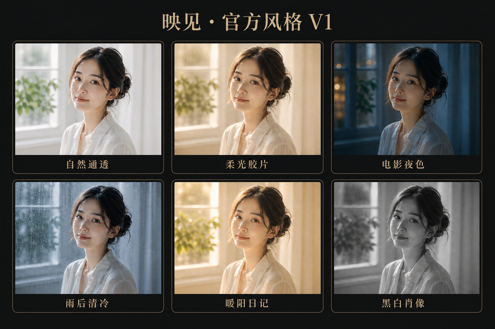

# 映见风格系统

> 状态：产品与领域合同。本文定义风格来源、`StyleDefinition`、不可见执行语言，以及“图片应用”和“动起来”两个任务入口的执行边界。首阶段页面、状态和验收见 [MVP Spec](mvp-spec.md)。

## 1. 核心模型

风格是映见唯一的用户创作单位。用户选择或表达“想要什么感觉”，系统负责把意图变成可验证、可预览、可保存的风格定义。

风格系统使用四个层次：

| 层次 | 含义 | 用户是否可见 |
|---|---|---|
| `StyleBrief` | 用户选择的官方风格，或确认后的文字、语音转写、参考图意图 | 可见、可修改 |
| `StyleDefinition` | AI 或官方资产产出的结构化、版本化风格合同 | 名称、说明和来源可见 |
| `StyleRecipe` | 把风格定义编译为当前设备可执行的确定性参数与能力计划 | 不可见 |
| `GenerationRequest` | 用源图、风格定义和生成意图创建新内容的异步任务 | 状态、成本和结果可见 |

用户界面只围绕 `StyleBrief`、`StyleDefinition` 和结果沟通。`StyleRecipe`、参数范围、能力目录、模型和供应商只属于执行系统。

## 2. StyleDefinition

`StyleDefinition` 是官方风格、文字、语音、参考图和后续混合表达共同使用的唯一规范对象。每个定义至少包含：

| 字段 | 合同 |
|---|---|
| `schemaVersion` | 定义结构版本；未知版本拒绝执行或显式迁移 |
| `styleId` | 风格稳定身份；用户定义风格也必须有本地唯一 ID |
| `revision` | 当前风格内容版本；已保存创作固定使用当时版本 |
| `origin` | `official`、`text`、`voice`、`reference` 或 `mixed` |
| `title` | 简短、结果导向、可本地化的风格名 |
| `summary` | 一句话说明整体感觉，不列举工具和参数 |
| `visualIntent` | 结构化描述色彩关系、光线、氛围、质感、主体呈现和背景关系 |
| `contentPolicy` | 身份保持、允许变化、禁止变化和不适用条件 |
| `applicationPolicy` | 是否支持确定性静态应用及所需能力版本 |
| `generationPolicy` | 是否支持动态或后续生成，以及允许的生成意图 |
| `provenance` | 官方资产版本或用户确认输入的本地来源引用；不写入遥测 |
| `createdAt` | 用于项目恢复和审计的本地创建时间 |

`StyleDefinition` 不包含用户可调参数、滑杆值或供应商专用对象。它描述“结果应该是什么”，执行系统再根据当前图片和设备能力编译 `StyleRecipe`。

### 2.1 风格定义完成条件

首页先确定 `creationIntent=apply|motion`。只有同时满足以下条件，风格才进入与任务对应的 `applyStyleReady` 或 `motionStyleReady`：

1. 结构符合当前 schema；
2. 来源输入已由用户确认；
3. 视觉意图足够明确，不依赖隐藏自由文本；
4. 内容和身份安全边界完整；
5. 当前图片支持已经选择的任务路径；
6. 所需能力和版本可解析；
7. 预览已绑定正确的源图与风格版本并成功显示。

任一条件失败时，系统保留上一个成功风格，不生成部分生效结果。

## 3. 官方风格

官方风格是人工策划、固定版本、经过样片和设备验证的 `StyleDefinition`。它们提供最快的“定风格”路径，不构成推荐算法或固定三选一。

每个官方风格必须具备：

- 独立名称、视觉样例和一句审美说明；
- 与其他同时展示风格足够明显的结果差异；
- 明确适用和不适用输入；
- 固定的 `styleId`、`revision`、能力版本和回退行为；
- 静态应用质量证据；支持动态生成时还需独立动态质量证据；
- 预览、保存和恢复使用同一风格语义；
- 下架或升级后，旧项目仍能识别并恢复其冻结版本。

官方风格可以按最近使用、收藏或运营顺序展示，但用户看到的是一组完整审美结果，不是滤镜、调色、人像、画质等工具分类。

### 3.1 首批官方风格 V1

首批风格使用少而强的六个方向验证“用户是否能一眼区分，并在一次点选后得到可用结果”。它们不是六个固定 UI 槽位，也不是推荐排名。

| `styleId` | 展示名 | 静态视觉意图 | 可选动态方向 |
|---|---|---|---|
| `official.natural_clear.v1` | 自然通透 | 中性白、柔和自然光、真实肤色、清楚细节 | 发丝、窗纱或环境光的克制微动 |
| `official.soft_film.v1` | 柔光胶片 | 奶油高光、柔和反差、轻微晕光与细颗粒 | 光线轻呼吸、环境中的缓慢自然变化 |
| `official.cinematic_night.v1` | 电影夜色 | 深青蓝暗部、克制暖色光源、浓郁但不死黑 | 灯光、倒影或背景氛围的细微运动 |
| `official.cool_after_rain.v1` | 雨后清冷 | 银蓝空气感、湿润反光、低饱和与安静情绪 | 水滴、薄雾、发丝或环境风的自然变化 |
| `official.golden_diary.v1` | 暖阳日记 | 午后金色逆光、通透阴影、轻怀旧日记感 | 阳光、窗帘、树影等真实缓慢变化 |
| `official.monochrome_portrait.v1` | 黑白肖像 | 中性黑白、丰富中间调、轻颗粒与克制黑位 | 呼吸、眼神、光影或背景的最小运动 |

视觉母版只冻结方向，不代表已经交付。每个风格必须先用同一组源照片验证身份保持、差异度、预览/导出一致和动态安全；未通过时保持 `待验证`，不能仅凭方向图进入生产目录。

## 4. 用户定义风格

### 4.1 文字

文字入口接受用户自然表达，例如氛围、时代感、色彩倾向、光线感觉和质感。系统执行：

1. 保存用户当前确认的 `StyleBrief`；
2. AI 把表达归一化为结构化视觉意图；
3. 内容策略移除或拒绝不能安全执行的要求；
4. 风格校验器验证 schema、能力和版本；
5. 编译预览并返回风格名、说明和结果。

用户无需使用专业词汇。系统不得要求用户先选择工具或填写参数；确需澄清时，只询问一个会改变最终方向的问题。

### 4.2 语音

语音是输入 `StyleBrief` 的另一种方式，不是独立风格系统：

- 只在用户主动操作后录音；
- 先转写，再由用户确认或重录；
- 确认文本进入与文字相同的定义、策略、校验和编译流程；
- 录音、转写或权限失败时提供文字等价路径；
- 普通日志和遥测不保存音频或完整转写。

### 4.3 参考图

参考图用于提取可迁移的视觉风格，不用于复制其具体内容。系统可以提取：

- 色彩关系与综合色温；
- 明暗、对比和光线气质；
- 颗粒、柔和、清晰等整体质感；
- 主体与背景的视觉层次；
- 可用文字概括的氛围与时代感。

系统不得把以下内容转成风格：

- 人物身份、人脸、身体或生物特征；
- 具体对象、场景布局和构图位置；
- 文字、签名、Logo、水印和可识别品牌元素；
- 明确受保护角色、作品或要求一比一复制的内容；
- 参考图中的隐私信息和元数据。

参考图生成的 `StyleDefinition` 必须显示新的风格名和说明，并保持源图内容为结果主体。参考图被移除后，已确认的定义可按其冻结版本继续存在；原参考文件按项目引用与隐私合同回收。

### 4.4 混合表达

用户可以在官方风格、文字、语音和参考图基础上继续表达，例如选择一个官方风格后说“更安静、更像雨天”。系统把最新确认输入合并成新的 `StyleDefinition` 版本，而不是在图片上叠加一个不可解释效果层。

每次新定义必须：

- 引用上一风格版本；
- 生成新的 revision；
- 重新经过安全、能力和预览校验；
- 成功后才成为当前风格；
- 失败时完整保留上一版本。

## 5. 风格编译与不可见执行语言

`StyleRecipe` 是 `StyleDefinition` 针对当前图片、平台能力和安全条件编译出的执行计划。它可以使用现有光色、质感、人像保护、画质和其他确定性参数，但必须满足：

- 参数和能力只来自版本化合法目录；
- 图片适用性只用于安全编译，不自动改变用户选择的风格身份；
- 同一源图、风格版本、编译器版本和平台能力产生可复现结果；
- 预览和最终静态输出使用相同语义与处理顺序；
- 不支持或低置信度能力被明确拒绝或安全降级；
- 编译失败不产生半风格结果；
- UI、文案、无障碍和遥测不暴露内部参数。

用户想改变效果时，系统创建新风格定义或切换风格；产品不提供参数滑杆、工具面板或“高级编辑”逃生口。

## 6. 图片应用与动起来

首页以“图片应用”和“动起来”两个大入口先确定任务。两条路径都可以使用结构一致的 `StyleDefinition`，但它们是不同的产品承诺：

任务选择发生在选图和定风格之前；进入任务后只显示该任务的风格范围和唯一主操作，不共享 ready 页面。动起来路径直接使用其源图和当前风格定义，静态应用结果不是生成任务的前置输入。

| 维度 | 应用风格 | 生成内容 |
|---|---|---|
| 用户意图 | 让原图呈现当前风格 | 基于原图和当前风格创建新内容 |
| 内容变化 | 保持原有对象和时刻 | 可创建新像素、帧和时间变化 |
| 执行方式 | 优先确定性、本地、即时 | 通常异步，可使用云端模型 |
| 任务创建 | 从首页进入图片应用，风格可用后直接执行 | 从首页进入动起来，用户确认上传、等待和费用后创建 |
| 结果 | 静态应用结果 | 独立生成资产 |
| 撤销与恢复 | 可回到原图或其他风格 | 取消任务或删除生成资产，不修改静态状态 |
| 失败影响 | 保留原图和上一个成功结果 | 保留原图、风格和任何已有结果 |
| 成本 | 默认不消耗云端生成额度 | 按明确生成合同计费或扣额度 |

硬边界：

- “应用风格”不得静默创建生成任务或上传原图。
- “生成”不得覆盖原图、当前 `StyleDefinition` 或任何已有结果。
- 预览静态风格不得扣除动态生成额度。
- 两条路径的成功、失败、保存和分享状态分别记录。
- 图片应用页只显示“应用风格”，动起来页只显示“让图片动起来”；切换任务必须返回首页。

## 7. 第一阶段动态生成

第一阶段生成只完成“让图片动起来”闭环。动态任务的输入为：

- 一张只读源图；
- 一个已校验的 `StyleDefinition` 固定版本；
- 一个明确、受支持的运动意图；
- 当前生成策略、供应商和模型版本；
- 用户确认的上传、成本和输出合同。

默认运动意图应由风格和图片安全推导，优先自然、克制、可循环观看的变化。产品不要求用户配置时间线、镜头参数、运动强度或关键帧；用户需要改变动态方向时，用文字或语音重新定义运动意图。

### 7.1 动态安全边界

- 保持主体身份、数量和基本结构；
- 避免无意的脸型、身体、手指、文字和背景结构漂移；
- 不自动创建说话、对口型、暴力、裸露或身份冒用内容；
- 静态输入不适合安全动画时，在创建任务前明确拒绝；
- 生成完成后检查文件完整性、时长、方向、可播放性和明显灾难性错误；
- 未通过结果不得进入 `motionReady` 或扣为成功交付。

### 7.2 动态任务合同

- 同一确认动作只创建一个幂等任务；
- 任务以稳定 ID 追踪准备、上传、生成、结果处理和完成状态；
- 可取消阶段必须真实取消，不能只关闭界面；
- 网络或生命周期变化后重新关联原任务，不自动复制任务；
- 超时、失败、策略拒绝和用户取消分别记录；
- 成功结果与源图、风格版本、生成版本和文件摘要绑定；
- 动态结果可播放、暂停、保存、分享和从项目中删除。

静态扩图、换场景、写真、通用文字生图和完整视频编辑属于后续生成类型；它们必须另行定义结果、成本和安全合同，不能复用“动起来”名称模糊上线。

## 8. 持久化与版本

- 项目保存当前 `StyleDefinition` 的完整冻结快照，不只保存官方风格 ID 或用户原始输入。
- 官方风格发布新 revision 时，已有项目继续使用旧快照；用户主动升级后才创建新版本。
- 文字、语音、参考图和混合定义都使用稳定本地 ID 与递增 revision。
- `StyleRecipe` 缓存可以重建，不是风格事实源；缓存版本不匹配时重新编译。
- 动态任务和结果引用确切源图、风格 revision、生成策略版本和任务 ID。
- 原始语音、临时上传文件和参考图只在仍被当前任务合法引用时保留，引用结束后按隐私合同回收。
- 未知 schema、缺失字段、越界能力或不兼容版本必须拒绝或显式迁移，不能静默套用近似风格。

## 9. 质量门

### 9.1 风格质量

- 同时展示的官方风格在盲评中能够被稳定区分，而不是只存在轻微参数差异。
- 风格名称、说明、视觉样例和实际结果表达同一方向。
- 文字、语音确认文本和参考图产生的定义能被用户复述为其原意。
- 预览、最终静态输出和项目恢复保持同一风格身份。
- 风格应用不产生身份变化、明显局部错误或隐藏生成内容。

### 9.2 系统正确性

- 所有来源生成的 `StyleDefinition` 通过同一 schema、安全和能力校验。
- 相同确认文本通过文字和语音进入相同定义路径。
- 过期 AI、预览和生成响应不能覆盖较新的风格版本。
- 图片应用路径永远不创建网络生成任务；动起来路径在用户确认前不创建网络图片任务。
- 生成取消、失败和恢复不会修改源图、当前风格或任何已有结果，也不会重复扣费。
- 项目冷启动能恢复确切风格快照和原生成任务身份。

### 9.3 完成定义

风格系统首阶段完成必须同时证明：

1. 官方风格、文字、语音和参考图都能产出统一 `StyleDefinition`；
2. `StyleDefinition` 能编译、预览、保存、恢复和版本迁移；
3. 静态应用从原图得到可保存结果，且不暴露底层参数；
4. 当前风格能创建、取消、恢复并完成一个“让图片动起来”任务；
5. 图片应用与动起来从首页入口开始就在 UI、状态、持久化、隐私、费用、失败和结果身份上完全分离；
6. 自动化、iOS Simulator、冻结候选真机和人工视觉质量门按 [MVP Spec](mvp-spec.md)完成。

任一来源只能生成描述但不能预览，或任一路径只能显示入口却不能保存结果时，均不属于完整闭环。
